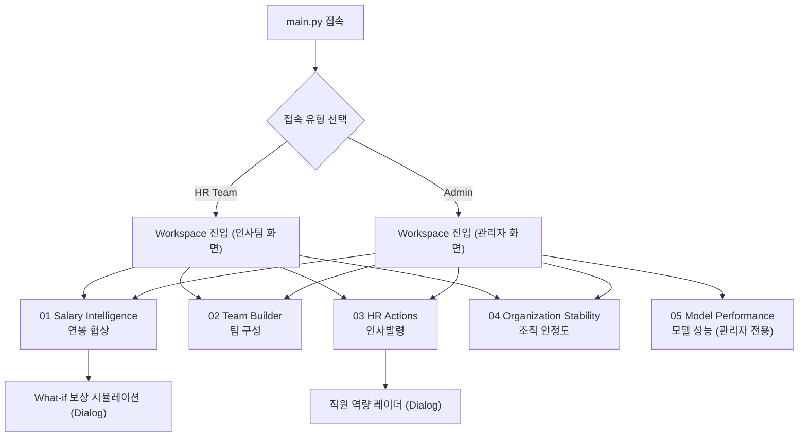
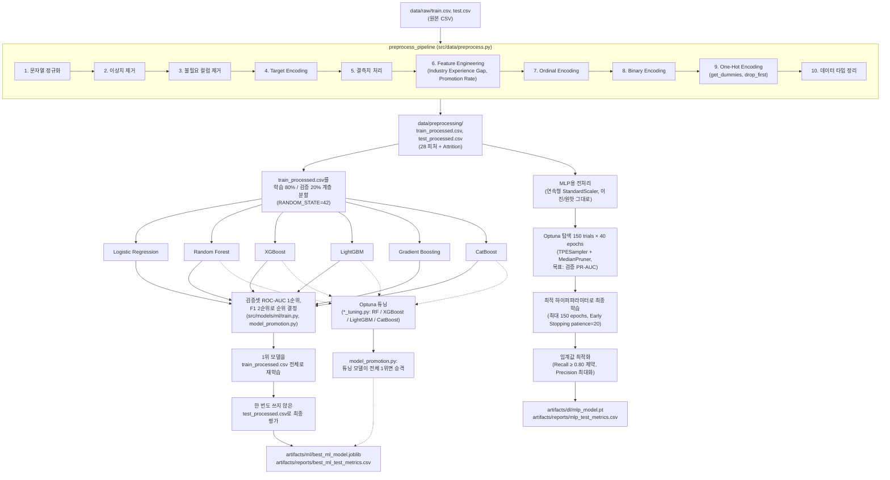

<div align="center">

# ⚓ STAYON

### HR Attrition Intelligence Platform · 기업 직원 퇴사 예측 시스템


</div>

URL : https://skn35-2nd-5team-ghnprc4w4etel28hrqhdga.streamlit.app/  

---

## 👥 팀 소개

<div align="center">

### 🏷️ Team **SKN35-2nd-5Team** | Project **STAYON**

> 실명 확인이 어려워 git 커밋 아이디 기준으로 표기했습니다. 담당 영역은 각 아이디의 파일 변경 이력(`git log --author --name-only`) 기준으로 가장 많이 손댄 영역을 표기한 것으로, 실제 역할 분담과 다를 수 있습니다.

|       이름(git ID)        | 담당 (커밋 이력 기준)                                                                       |
| :-----------------------: | :------------------------------------------------------------------------------------------ |
| [kimgyeongmin5348](https://github.com/kimgyeongmin5348) / 김경민(PM) | 대시보드 페이지(`pages/`) · ML 모델링(`src/models/ml/`) · README                            |
| [chan3623](https://github.com/chan3623) / 박찬룡                 | 딥러닝 모델(`src/models/dl/`) · Views(`src/views/`) · DB 연동(`src/database/`, `src/data/`) |
| [inaskn35](https://github.com/inaskn35) / 장인화                 | ML 모델링(`src/models/ml/`, Random Forest 튜닝)                                             |
| [juvia2](https://github.com/juvia2) / 김연주                     | ML 모델링(`src/models/ml/`)                                                                 |

</div>

직원 속성 데이터를 학습해 **퇴사(attrition)를 예측**하고, 예측 확률을 인재 가치 지수와 결합해
연봉 협상 · 팀 구성 · 인사발령 · 조직 안정도 진단까지 이어주는 HR 의사결정 지원 대시보드입니다.

---

## 🎯 프로젝트 목표

|  #  | 목표                              | 설명                                                                                                |
| :-: | --------------------------------- | --------------------------------------------------------------------------------------------------- |
|  1  | **퇴사 예측 모델 개발**           | 직원 속성(연봉·근속·만족도·승진 이력 등)을 기반으로 퇴사 여부를 예측하는 ML/DL 이진 분류 모델 구축  |
|  2  | **인재 가치 지표 설계**           | 원본 데이터에는 없는 인재 가치·팀 적합·인사발령 우선순위·조직 안정도 지수를 정의해 예측 확률과 결합 |
|  3  | **HR 시나리오별 대시보드 제공**   | 연봉 협상, 팀 구성, 승진/구조조정/재배치, 조직 안정도 모니터링 4개 실무 시나리오를 화면으로 구현    |
|  4  | **모델 성능 비교·검증 화면 제공** | ML 6종(LR·RF·GB·XGBoost·LightGBM·CatBoost) 및 DL(MLP) 성능을 관리자 화면에서 비교하고 최종 모델 선정 근거 제시 |
|  5  | **What-if 시뮬레이션**            | 보상(월 소득 등) 변경 시 퇴사 확률이 어떻게 바뀌는지 실시간으로 재예측하는 시뮬레이터 구현          |

> ⚠️ 시간 관계상 실제 로그인 인증은 구현하지 않았습니다. `main.py`에서 **HR Team / Admin** 접속 유형만 선택하는 간단한 분기 화면으로 대신합니다.

---

## 기술 스택 (요약)

| 영역             | 사용 기술                                                                           |
| ---------------- | ----------------------------------------------------------------------------------- |
| Web / Dashboard  | Streamlit, streamlit_components(커스텀 Wheel Picker)                                |
| 데이터 처리      | pandas, numpy                                                                       |
| 시각화           | Plotly, Matplotlib                                                                  |
| 머신러닝         | scikit-learn, XGBoost, LightGBM, CatBoost, Optuna(하이퍼파라미터 튜닝)              |
| 딥러닝           | PyTorch (MLP, Optuna 기반 아키텍처 탐색)                                            |
| 모델 직렬화      | joblib                                                                              |
| DB/Storage       | MySQL(`mysql-connector-python`, `pymysql`) — 원본/전처리 데이터 및 예측 결과 적재용 |
| 환경 변수        | python-dotenv                                                                       |
| 패키지/환경 관리 | uv                                                                                  |
| 기타             | shap(의존성 선언, 현재 코드 경로 미사용), nbformat, requests                        |

---

## WBS (구현 단계)

| 단계                 | 작업 항목                                                                                                | 산출물                                                                                    |
| -------------------- | -------------------------------------------------------------------------------------------------------- | ----------------------------------------------------------------------------------------- |
| **1. 기획/정의**     | 문제 정의, 퇴사(Attrition) 라벨 확인, 인재 가치·팀 적합·안정도 등 파생 지표 설계                         | 지표 정의 (`src/utils/hr_metrics.py`)                                                     |
| **2. 데이터 준비**   | 원본 CSV 정제, Target/Ordinal/Binary/One-Hot 인코딩, 파생 피처 생성                                      | 전처리 파이프라인(`src/data/preprocess.py`), `train_processed.csv` / `test_processed.csv` |
| **3. 모델 개발(ML)** | Logistic Regression · Random Forest · Gradient Boosting · XGBoost · LightGBM · CatBoost 학습·비교, Optuna 튜닝 | `artifacts/ml/best_ml_model.joblib`, `ml_leaderboard.csv`                              |
| **4. 모델 개발(DL)** | PyTorch MLP 설계, Optuna 150 trials 탐색, 임계값 최적화                                                  | `artifacts/dl/mlp_model.pt` 등                                                            |
| **5. 대시보드 구축** | Salary Intelligence · Team Builder · HR Actions · Organization Stability · Model Performance 5개 탭 구현 | `pages/01_Workspace.py`, `src/views/tab_*.py`                                             |
| **6. DB 연동**       | 원본/전처리/예측 결과 MySQL 적재·조회 스크립트 구현                                                      | `src/database/`, `src/data/insert_dataset.py`, `insert_database.py`                       |
| **7. 통합/검증**     | 역할별(HR/Admin) 탭 라우팅 점검, What-if 시뮬레이션·역량 레이더 다이얼로그 검증                          | 최종 통합 대시보드(`main.py` → `pages/01_Workspace.py`)                                   |

---

## 시스템 아키텍처 / 서비스 흐름

### 접속 및 화면 라우팅

> `main.py`에서 접속 유형(HR Team / Admin)을 선택하면 `pages/01_Workspace.py`로 이동하며, 선택한 역할에 따라 노출되는 탭이 달라집니다. 실제 로그인 인증은 없고 `st.session_state["role"]`로만 구분합니다.



### ML/DL 파이프라인

> 원본 CSV → 공통 전처리 → 학습/검증 분할 → ML 6종 비교 및 Optuna 튜닝 → 최종 모델 재학습 → 홀드아웃 테스트셋 평가, DL(MLP)은 별도 경로로 Optuna 탐색 후 임계값 최적화까지 진행합니다.



> 실제 서비스(Streamlit 대시보드)의 01~04번 HR 기능은 Recall을 우선한 **DL(MLP)** 모델을 사용합니다. `artifacts/ml/best_ml_model.joblib`의 CatBoost는 최고 ML 비교 모델 및 이전 화면 호환 경로로 보관되며, 05번 관리자 탭에서 ML-vs-DL 성능을 함께 비교합니다.

---

## 1. 주요 기능 (세부 구현)

Workspace(`pages/01_Workspace.py`)는 5개 탭(`src/views/tab_*.py`)으로 구성되며, `role` 값에 따라 인사팀에게는 01~04번, 관리자에게는 01~05번 탭이 노출됩니다.

1. **01 · Salary Intelligence** — 부서→직급→직원 ID 순 커스텀 휠 피커로 직원을 조회하고, 퇴사 위험도·위험 등급·인재 가치 지수·현재 소득을 확인. 플로팅 버튼으로 **What-if 보상 시뮬레이션** 다이얼로그를 열어 월 소득 변경 시 퇴사 확률 Before/After/Change를 실시간 비교 (`src/data/prediction.py`의 `prepare_model_input`으로 저장된 모델에 그대로 입력).
2. **02 · Team Builder** — 부서·직급·인원수를 지정하면 **팀 적합 점수**(인재 가치 지수 × 0.6 + (1 − 예측 퇴사확률) × 100 × 0.4) 순으로 후보를 채워주고, 팀 평균 퇴사 위험 기준 안정적/양호/주의 필요/위험 판정을 제공. 동일 부서·직급 내 대체 후보 추천도 포함.
3. **03 · HR Actions** — 승진·구조조정·재배치 3개 시나리오를 각각 다른 가중치의 우선순위 점수로 랭킹화(`add_people_decision_scores`). 세그먼트 탭 전환 + 페이지네이션, 직원 카드 클릭 시 학력·성과·평판·경력·리더십 5축 **역량 레이더 차트** 다이얼로그 표시.
4. **04 · Organization Stability** — 전사 **조직 안정도 지수**((1 − 평균 예측 퇴사확률) × 100)와, 소득·초과근무·만족도·워라밸·승진 횟수·근속연수 등 후보 피처를 구간별 퇴사율 편차로 정렬한 **영향력 순위**를 제공. 근속연수별 퇴사율 추이, 부서별 요약 카드 포함.
5. **05 · Model Performance (관리자 전용)** — ML 6종(LR·RF·GB·XGBoost·LightGBM·CatBoost) 리더보드와 혼동행렬, DL(MLP) 성능 카드, ML-vs-DL Big Number 비교, 검증 ROC-AUC 우선·F1 보조 기준의 모델 선정 근거를 제공.

---

## 2. 인공지능 데이터 전처리 결과서

- **목적**: 직원 속성을 퇴사 여부 예측 모델이 학습할 수 있는 28개 수치형 피처로 변환
- **입력/정답**: 직원 속성 기반 이진 분류 데이터셋, 원본 `Left`→`Attrition=1`, `Stayed`→`Attrition=0`
- **기준 코드**: `src/data/preprocess.py`, `src/utils/constants.py`
- **처리 원칙**: 테스트 데이터의 결측치 대푯값과 원핫 컬럼 구조는 학습 데이터를 기준(`reference`)으로 맞춰 데이터 누수를 방지

| 구분                   | 경로                                     |  행 수 |                      열 수 |
| ---------------------- | ---------------------------------------- | -----: | -------------------------: |
| 원본 학습 데이터       | `data/raw/train.csv`                     | 59,598 |                         24 |
| 원본 테스트 데이터     | `data/raw/test.csv`                      | 14,900 |                         24 |
| 전처리된 학습 데이터   | `data/preprocessing/train_processed.csv` | 59,598 | 29 (피처 28 + `Attrition`) |
| 전처리된 테스트 데이터 | `data/preprocessing/test_processed.csv`  | 14,900 | 29 (피처 28 + `Attrition`) |

### 전처리 품질 검증 결과

현재 저장된 CSV를 기준으로 행 수, 결측치, 완전 중복 행, 타깃 분포를 점검한 결과입니다.

| 데이터 | 결측 셀 | 완전 중복 행 | 재직(`0`/`Stayed`) | 퇴사(`1`/`Left`) | 퇴사 비율 |
| ------ | -------: | -----------: | -----------------: | ----------------: | ---------: |
| 원본 학습 | 0 | 0 | 31,260 | 28,338 | 47.55% |
| 전처리 학습 | 0 | 0 | 31,260 | 28,338 | 47.55% |
| 원본 테스트 | 0 | 0 | 7,868 | 7,032 | 47.19% |
| 전처리 테스트 | 0 | 0 | 7,868 | 7,032 | 47.19% |

- 전처리 전후 행 수와 타깃 분포가 동일해 현재 데이터에서는 이상치 제거로 탈락한 행이 없습니다.
- `Employee ID`는 식별자이므로 학습 피처에서 제외되며, 서비스 화면에서는 원본 데이터의 직원 조회 키로만 사용합니다.
- 최종 29개 열은 정수형 28개와 실수형 1개(`Promotion Rate`)로 구성되고 결측값은 없습니다.

### X값 전처리 (`src/data/preprocess.py`)

| 단계 | 기법                | 목적                                                          |
| :--: | ------------------- | ------------------------------------------------------------- |
|  1   | 문자열 정규화       | 범주형 값 표기 통일                                           |
|  2   | 이상치 제거         | 비정상 값 필터링                                              |
|  3   | 불필요 컬럼 제거    | 예측에 불필요한 원본 컬럼 정리                                |
|  4   | Target Encoding     | 범주형 변수 인코딩                                            |
|  5   | 결측치 처리         | 결측값 대체/제거                                              |
|  6   | Feature Engineering | `Industry Experience Gap`, `Promotion Rate` 파생 피처 생성    |
|  7   | Ordinal Encoding    | 순서형 변수 인코딩                                            |
|  8   | Binary Encoding     | 이진 변수 인코딩                                              |
|  9   | One-Hot Encoding    | `Job Role`, `Marital Status` 등 (`get_dummies`, `drop_first`) |
|  10  | 데이터 타입 정리    | 최종 dtype 정돈                                               |

### 전처리 산출 결과

| 구분 | 결과 |
| ---- | ---- |
| 제거 피처 | `Employee ID` (그 외 상수형 후보 컬럼은 현재 원본에 없음) |
| 파생 피처 | `Industry Experience Gap = max(Company Tenure - Years at Company, 0)`, `Promotion Rate = Number of Promotions / (Years at Company + 1)` |
| 순서형 인코딩 | 직급, 회사 규모, 회사 평판, 워라밸, 직원 인정, 직무 만족도, 성과 평가, 학력 |
| 이진 인코딩 | 성별, 초과근무, 원격근무, 리더십 기회, 혁신 기회 |
| 원핫 인코딩 | `Job Role` 4개 열, `Marital Status` 2개 열 (`drop_first=True`) |
| 최종 산출물 | `train_processed.csv`, `test_processed.csv` — 동일한 28개 입력 피처 순서 보장 |

> StandardScaler / PolynomialFeatures / PCA는 공유 전처리 단계에 포함하지 않고, 모델 학습 시점에 학습 데이터에만 fit되도록 분리되어 있습니다.

### 피처 명세서 (일부)

|  #  | 피처명                     | 설명                                 |
| :-: | -------------------------- | ------------------------------------ |
|  1  | `Age`                      | 나이                                 |
|  2  | `Years at Company`         | 근속연수                             |
|  3  | `Monthly Income`           | 월 소득                              |
|  4  | `Work-Life Balance`        | 워라밸 점수                          |
|  5  | `Job Satisfaction`         | 직무 만족도                          |
|  6  | `Performance Rating`       | 성과 평가                            |
|  7  | `Number of Promotions`     | 승진 횟수                            |
|  8  | `Overtime`                 | 초과근무 여부                        |
|  9  | `Distance from Home`       | 통근 거리                            |
| 10  | `Company Reputation`       | 회사 평판                            |
| 11  | `Leadership Opportunities` | 리더십 기회                          |
| 12  | `Industry Experience Gap`  | (파생) 업계 경력 격차                |
| 13  | `Promotion Rate`           | (파생) 승진 속도                     |
|  —  | `Attrition`                | **Y값** — 퇴사 여부 (1=퇴사, 0=재직) |

전체 28개 피처(원핫 인코딩된 `Job Role_*`, `Marital Status_*` 포함) 목록은 `src/utils/constants.py` 참고.

---

## 3. 인공지능 학습 결과서

### 학습·평가 설계

| 항목 | 적용 내용 |
| ---- | --------- |
| 문제 유형 | 직원 퇴사 여부 이진 분류 |
| 학습/검증 | `train_processed.csv`를 80:20 계층 분할 (`random_state=42`) |
| 최종 평가 | 모델 선택에 사용하지 않은 `test_processed.csv` 14,900행을 홀드아웃 테스트셋으로 사용 |
| ML 선택 기준 | 검증 ROC-AUC 내림차순, 동률 시 F1 내림차순 |
| ML 튜닝 | Optuna 기반, CatBoost는 3-fold Stratified CV ROC-AUC 최적화(기본 30 trials, 600초 제한) |
| DL 튜닝 | 검증 PR-AUC를 목표로 150 trials × 최대 40 epochs 탐색 후 최대 150 epochs 최종 학습 |

### 인재 가치 지표 설계 (`src/utils/hr_metrics.py`)

원본 데이터에는 "이 직원이 얼마나 가치 있는가"를 나타내는 지표가 없어, 학력·성과평가·회사평판·경력연수·리더십 기회 5개 항목을 동일 가중치로 환산한 **인재 가치 지수(0~100)**를 별도로 설계하고, 모델의 퇴사 확률(0~1)과 시나리오별로 다르게 가중합하여 아래 지표를 산출합니다.

| 지표                    | 공식                                                                         |
| ----------------------- | ---------------------------------------------------------------------------- |
| 팀 적합 점수            | 인재 가치 지수 × 0.6 + (1 − 예측 퇴사확률) × 100 × 0.4                       |
| 승진 우선 점수          | 인재 가치 지수 × 0.65 + (1 − 예측 퇴사확률) × 100 × 0.35                     |
| 구조조정 검토 우선 점수 | (100 − 인재 가치 지수) × 0.55 + 예측 퇴사확률 × 100 × 0.45                   |
| 재배치 신호 점수        | 인재 가치 지수 × 0.5 + (100 − 만족도 점수) × 0.3 + 예측 퇴사확률 × 100 × 0.2 |
| 조직 안정도 지수        | (1 − 전체 평균 예측 퇴사확률) × 100                                          |

### 모델 비교 — 검증셋 (`artifacts/reports/ml_leaderboard.csv`)

`artifact_path`가 `*_tuned.joblib`인 행은 Optuna 튜닝 결과가 기본 모델보다 좋아 리더보드에 승격된 버전입니다.

| 모델                | Accuracy | Precision | Recall |     F1 | ROC-AUC | Average Precision |
| ------------------- | -------: | --------: | -----: | -----: | ------: | ----------------: |
| **CatBoost (Tuned)** | **0.7544** | **0.7414** | **0.7426** | **0.7420** | **0.8522** | **0.8433** |
| XGBoost (Tuned)      | 0.7560 | 0.7439 | 0.7424 | 0.7431 | 0.8512 | 0.8419 |
| LightGBM (Tuned)     | 0.7576 | 0.7461 | 0.7429 | 0.7445 | 0.8503 | 0.8408 |
| Gradient Boosting    | 0.7544 | 0.7450 | 0.7354 | 0.7401 | 0.8493 | 0.8393 |
| Random Forest        | 0.7495 | 0.7266 | 0.7586 | 0.7423 | 0.8414 | 0.8292 |
| Logistic Regression  | 0.7369 | 0.7256 | 0.7184 | 0.7220 | 0.8279 | 0.8157 |

### 모델 비교 — 테스트셋 (Optuna 튜닝 후, `artifacts/reports/*_tuned_metrics.csv`, `best_ml_test_metrics.csv`, `mlp_test_metrics.csv`)

| 모델                             |   Accuracy |  Precision |     Recall |         F1 |    ROC-AUC | Average Precision |
| -------------------------------- | ---------: | ---------: | ---------: | ---------: | ---------: | ----------------: |
| **CatBoost (Tuned) ★ 최고 ML**   | **0.7633** | **0.7495** | **0.7486** | **0.7491** | **0.8545** | **0.8441** |
| LightGBM (Tuned)                 | 0.7625 | 0.7488 | 0.7474 | 0.7481 | 0.8532 | 0.8428 |
| XGBoost (Tuned)                  | 0.7619 | 0.7475 | 0.7482 | 0.7478 | 0.8534 | 0.8428 |
| Random Forest (Tuned)            | 0.7548 | 0.7311 | 0.7598 | 0.7452 | 0.8455 | 0.8319 |
| MLP (DL, threshold=0.44)         | 0.7507 | 0.7044 | 0.8131 | 0.7549 | 0.8472 | 0.8339 |

- **최종 선정**: 검증 ROC-AUC가 가장 높은 CatBoost(Tuned)를 `src/utils/model_promotion.py`가 전체 1위로 승격했습니다.
- **홀드아웃 결과**: CatBoost는 테스트셋에서도 ROC-AUC 0.8545, Average Precision 0.8441로 비교 대상 중 가장 높았습니다.
- **혼동행렬**: TN 6,109 / FP 1,759 / FN 1,768 / TP 5,264 (`artifacts/reports/best_ml_test_metrics.csv`).
- 테스트셋은 최종 일반화 성능 확인에만 사용하고 모델 선정은 검증셋 기준으로 수행합니다.

### DL(MLP) 학습 방법 (`src/models/dl/`)

> PyTorch 기반 MLP(표준 구조 또는 Residual Block 구조 선택 가능)를 대상으로 Optuna `TPESampler` + `MedianPruner`로 150회 시도 × 최대 40 epoch 탐색(목표: 검증 PR-AUC)을 수행한 뒤, 최적 하이퍼파라미터로 최대 150 epoch 재학습(Early Stopping patience=20)합니다. 이후 재현율(Recall) ≥ 0.80 제약 하에서 정밀도(Precision)를 최대화하는 임계값(현재 0.44)을 탐색해 최종 저장합니다.

현재 저장된 MLP는 GELU 활성화 함수의 은닉층 2개(160→256), batch size 128인 일반 MLP입니다. 테스트셋에서 Precision과 ROC-AUC는 최고 ML보다 낮지만 Recall은 0.8131로 가장 높아, 퇴사 위험 직원을 놓치지 않는 것을 우선하는 01~04번 HR 업무 화면의 실시간 예측 모델로 채택했습니다.

---

## 4. 학습된 인공지능 모델

### HR 서비스 모델 — MLP

| 항목 | 내용 |
| ---- | ---- |
| 모델 | **PyTorch MLP (GELU, 160→256, Dropout 적용)** |
| 가중치 | `artifacts/dl/mlp_model.pt` |
| 전처리/설정 | `mlp_scaler.pkl`, `mlp_best_params.pkl`, `mlp_threshold.pkl`, `mlp_metadata.pkl` |
| 분류 임계값 | 0.44 (검증 Recall ≥ 0.80 조건에서 최적화) |
| 입력 규격 | `Attrition`을 제외한 전처리 피처 28개 |
| 출력 | `predict_proba(X)[:, 1]` 형태의 퇴사 확률 |
| 사용 위치 | `pages/01_Workspace.py`에서 로드되어 01~04번 HR 의사결정 탭의 예측에 사용 |

`src/models/dl/predict.py`의 `MLPPredictionModel`이 PyTorch 모델을 scikit-learn과 유사한 `predict`/`predict_proba` 인터페이스로 감쌉니다. 추론 시 `src/data/prediction.py::prepare_model_input`이 학습 피처명과 순서를 맞추므로 서비스 입력도 학습 당시의 28개 컬럼 계약을 유지합니다.

### 최고 성능 ML 모델 — CatBoost

| 항목 | 내용 |
| ---- | ---- |
| 모델 | **CatBoostClassifier (Optuna Tuned)** |
| 최고 ML 파일 | `artifacts/ml/best_ml_model.joblib` |
| 원본 튜닝 파일 | `artifacts/ml/catboost_tuned.joblib` |
| 파일 일치 여부 | 두 파일의 SHA-256 동일 (`4092b57a...f943ec8c`) |
| 주요 파라미터 | iterations=300, depth=3, learning_rate=0.0690, l2_leaf_reg=4.4187, random_strength=1.2504, border_count=128 |
| 역할 | ML 성능 비교의 최종 1위, 관리자 모델 성능 탭 및 이전 ML 예측 경로용 |

`best_ml_model.joblib`에는 중앙값 결측 대체 전처리기와 CatBoost 모델을 묶은 scikit-learn `Pipeline`이 저장되어 있습니다. 현재 HR 업무 화면의 기본 추론기는 MLP이므로, “최고 평가 ML 모델”과 “업무 목적상 채택한 서비스 모델”을 구분해야 합니다.

### 모델 아티팩트 명세

| 경로 | 역할 |
| ---- | ---- |
| `artifacts/ml/best_ml_model.joblib` | 검증 ROC-AUC 기준 최고 CatBoost 파이프라인 |
| `artifacts/ml/catboost_tuned.joblib` | 최종 CatBoost 튜닝 모델 원본 |
| `artifacts/ml/*_tuned.joblib` | RF, XGBoost, LightGBM 등 튜닝 후보 모델 |
| `artifacts/ml/*.joblib` | 기본 ML 비교 모델 |
| `artifacts/dl/mlp_model.pt` | PyTorch MLP의 `state_dict` |
| `artifacts/dl/mlp_scaler.pkl` | MLP 연속형 피처 표준화 전처리기 |
| `artifacts/dl/mlp_best_params.pkl` | MLP 구조·학습 최적 파라미터 |
| `artifacts/dl/mlp_threshold.pkl` | MLP 분류 임계값(0.44) |
| `artifacts/dl/mlp_metadata.pkl` | 입력 피처명, 입력 차원, 파라미터 메타데이터 |
| `artifacts/reports/` | 검증 리더보드, 테스트 성능, 튜닝 파라미터 리포트 |

> 모델 파일은 학습 당시 라이브러리 버전에 의존할 수 있으므로 `uv sync`로 `pyproject.toml`/`uv.lock` 환경을 맞춰 로드해야 합니다. 또한 joblib/pickle 파일은 임의 코드를 실행할 수 있으므로 신뢰할 수 있는 저장소의 아티팩트만 사용합니다.

---

## 5. 스크린샷

> 저장소에 스크린샷 자산이 아직 포함되어 있지 않습니다. 각 화면을 캡처한 뒤 `docs/screenshots/` 등에 저장하고 아래 링크를 교체해주세요.

| 화면                          | 스크린샷                   |
| ----------------------------- | -------------------------- |
| 접속 유형 선택 (`main.py`)    | _TODO: 스크린샷 추가 예정_ |
| 01 Salary Intelligence        | _TODO: 스크린샷 추가 예정_ |
| 02 Team Builder               | _TODO: 스크린샷 추가 예정_ |
| 03 HR Actions                 | _TODO: 스크린샷 추가 예정_ |
| 04 Organization Stability     | _TODO: 스크린샷 추가 예정_ |
| 05 Model Performance (관리자) | _TODO: 스크린샷 추가 예정_ |

---

## 6. 프로젝트 구조

```text
SKN35-2nd-5Team/
├─ main.py                        # 접속 유형 선택 랜딩 페이지
├─ wheel_picker.py                # 커스텀 휠 피커 컴포넌트 선언
├─ streamlit_ui.py                # 공통 디자인 시스템 · UI 컴포넌트 함수 모음
├─ insert_database.py             # 퇴사 예측 결과 DB 적재 실행 스크립트
├─ pyproject.toml / uv.lock
├─ .env                           # DB 접속 정보 (커밋되지 않음)
│
├─ pages/
│  ├─ 01_Workspace.py             # 역할별 탭 라우팅 · 데이터/모델 로딩
│  └─ _archive/                   # 이전 버전 페이지 (더 이상 사용되지 않음)
│
├─ src/
│  ├─ config.py                   # 경로 별칭(하위 호환용)
│  ├─ data/                       # loader · preprocess · prediction · DB insert/select
│  ├─ database/                   # MySQL 커넥션 · SELECT/INSERT
│  ├─ models/
│  │  ├─ ml/                      # 모델별 구현 + Optuna 튜닝 + 공통 train.py
│  │  └─ dl/                      # PyTorch MLP 구현 · 학습 · 평가
│  ├─ utils/                      # 상수 · hr_metrics · metrics · 학습 유틸 · 경로
│  └─ views/                      # tab_salary · tab_team · tab_hr_actions · tab_stability · tab_models
│
├─ streamlit_components/
│  └─ wheel_picker/index.html     # 커스텀 휠 피커 프론트엔드
│
├─ data/
│  ├─ raw/                        # train.csv, test.csv
│  └─ preprocessing/              # train_processed.csv, test_processed.csv
│
├─ artifacts/
│  ├─ ml/                         # 학습된 ML 모델(.joblib) + best_ml_model.joblib
│  ├─ dl/                         # MLP 가중치 · 스케일러 · 임계값
│  └─ reports/                    # 리더보드 · 성능 리포트 CSV/JSON
│
└─ notebooks/
   └─ test.ipynb
```

---

## 7. 개발 환경

### 소프트웨어 스펙

| 항목           | 버전                                        |
| -------------- | ------------------------------------------- |
| Python         | 3.12 (`.python-version`)                    |
| Streamlit      | ≥ 1.62                                      |
| scikit-learn   | ≥ 1.9                                       |
| XGBoost        | ≥ 3.4                                       |
| LightGBM       | ≥ 4.6                                       |
| CatBoost       | ≥ 1.2.8                                     |
| PyTorch        | ≥ 2.13                                      |
| Optuna         | ≥ 4.5                                       |
| pandas / numpy | ≥ 3.0 / ≥ 2.5                               |
| DB             | MySQL (`mysql-connector-python`, `pymysql`) |
| 패키지 관리    | uv                                          |

_(전체 버전 목록은 `pyproject.toml` 참고)_

### 하드웨어 스펙

| 항목            | 사양          |
| --------------- | ------------- |
| OS              | _(작성 필요)_ |
| CPU / RAM / GPU | _(작성 필요)_ |

---

## 8. 환경 설정

이 프로젝트는 [uv](https://github.com/astral-sh/uv)로 의존성을 관리합니다.

```bash
# 1. 저장소 클론
git clone https://github.com/SKNETWORKS-FAMILY-AICAMP/SKN35-2nd-5Team.git
cd SKN35-2nd-5Team

# 2. uv로 의존성 설치 (pyproject.toml 기준, Python 3.12 필요)
uv sync
```

### `.env` 설정 (시크릿은 커밋 금지)

DB 접속 정보는 원본/전처리 데이터와 예측 결과를 MySQL에 적재하는 스크립트(`insert_database.py`, `src/database/*`, `src/data/insert_dataset.py`, `src/data/select_dataset.py`)에만 필요합니다.

```env
# .env
DB_HOST=localhost
DB_USERNAME=your_user
DB_PASSWORD=your_password
DB_DATABASE=your_database
DB_PORT=3306
```

> Streamlit 앱 자체(`main.py`, `pages/01_Workspace.py`)는 `data/raw`, `data/preprocessing`의 로컬 CSV와 `artifacts/ml`의 저장된 모델 파일을 직접 읽으므로, `.env` 없이도 실행할 수 있습니다.

---

## 9. 실행 방법

> 프로젝트 루트(`SKN35-2nd-5Team`)에서 실행합니다.

```bash
uv run streamlit run main.py
```

### 🔗 접속 링크

| 서비스          | 주소                     |
| --------------- | ------------------------ |
| STAYON 대시보드 | <http://localhost:8501/> |

> `main.py`에서 **HR Team** 또는 **Admin** 접속 유형을 선택한 뒤 `pages/01_Workspace.py`로 진입합니다. 실제 로그인 인증은 구현되어 있지 않습니다.

---

## 데이터베이스 (선택)

MySQL 기반이며, 아래 3개 테이블이 코드에서 확인됩니다. 정확한 컬럼 타입 등 스키마(DDL)는 저장소에 없어 `N/A`로 남깁니다.

| 테이블                          | 용도                                               | 관련 코드                                                                     |
| ------------------------------- | -------------------------------------------------- | ----------------------------------------------------------------------------- |
| `employee_attrition_raw`        | 원본 train/test CSV를 `type` 컬럼으로 구분해 저장  | `src/database/send_db.py::insert_employee_attrition_raw`                      |
| `employee_attrition_processed`  | 전처리 완료 train/test 데이터 저장                 | `src/database/send_db.py::insert_employee_attrition_processed`                |
| `employee_attrition_prediction` | 직원별 퇴사 확률(`employee_id`, `prediction`) 저장 | `src/data/prediction.py::INSERT_PREDICTION_SQL`, `src/data/insert_dataset.py` |

> 실행 중인 Streamlit 앱은 이 DB를 조회하지 않습니다. DB는 원본/전처리 데이터를 외부에 적재하고 예측 결과를 내보내는 별도의 배치성 경로입니다.

---

## 향후 개선 방향

|  #  | 항목                     | 설명                                                                                         |
| :-: | ------------------------ | -------------------------------------------------------------------------------------------- |
|  1  | 인증/권한                | 현재는 로그인 없이 역할만 선택하는 임시 분기 화면 → 실제 사용자 인증·권한 관리 도입          |
|  2  | SHAP 기반 설명 가능한 AI | `shap`이 의존성으로 선언되어 있으나 현재 미사용 → 예측 근거를 피처 단위로 설명하는 기능 추가 |
|  3  | 운영 모델 모니터링       | MLP의 높은 Recall과 CatBoost의 높은 ROC-AUC/Precision을 실제 운영 데이터에서도 주기적으로 비교하고 재학습·승격 기준 자동화 |
