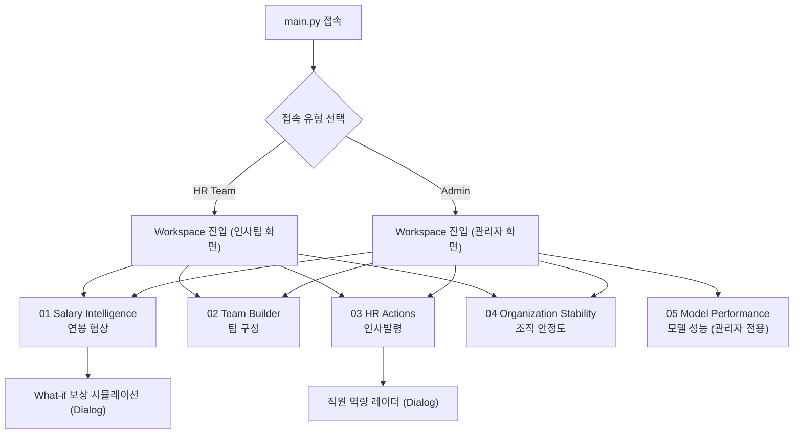
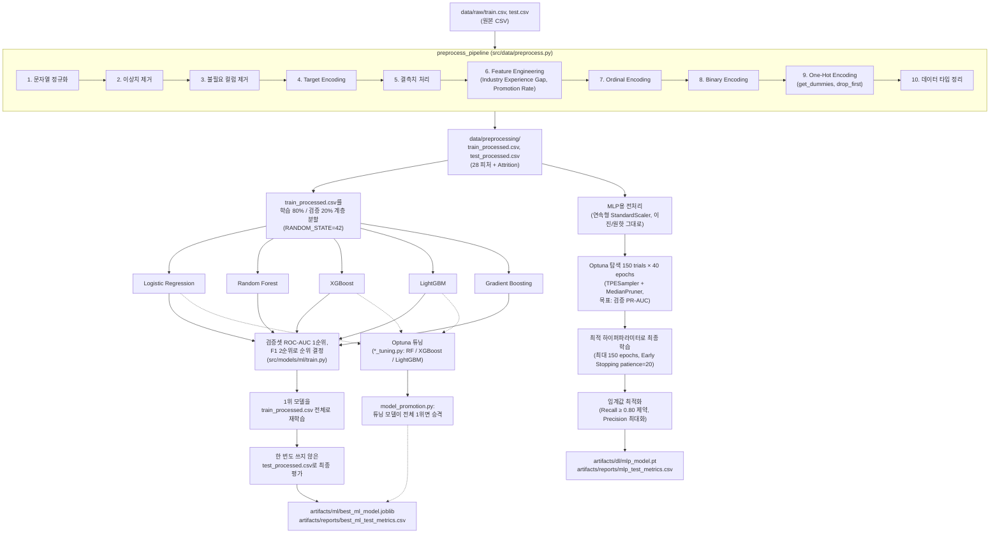

# STAYON — HR Attrition Intelligence Platform

직원 퇴사 예측 머신러닝/딥러닝 모델을 기반으로 연봉 협상, 팀 구성, 인사발령, 조직 안정도 진단을 지원하는 Streamlit 대시보드입니다.

`Python 3.12` · `Streamlit` · `scikit-learn / XGBoost / LightGBM` · `PyTorch` · `uv`

---

## 목차

1. [프로젝트 개요](#프로젝트-개요)
2. [기획 배경](#기획-배경)
3. [서비스 흐름](#서비스-흐름)
4. [주요 기능](#주요-기능)
5. [ML 파이프라인](#ml-파이프라인)
6. [데이터셋](#데이터셋)
7. [모델 개발](#모델-개발)
8. [기술 스택](#기술-스택)
9. [프로젝트 구조](#프로젝트-구조)
10. [설치 및 실행](#설치-및-실행)
11. [환경 변수](#환경-변수)
12. [데이터베이스](#데이터베이스)
13. [스크린샷](#스크린샷)
14. [성능 요약](#성능-요약)
15. [향후 개선 방향](#향후-개선-방향)

---

## 프로젝트 개요

**STAYON**은 직원 속성 데이터를 학습한 이진 분류 모델(퇴사 `1` / 재직 `0`)을 바탕으로, 개별 직원의 퇴사 확률을 예측하고 이를 실제 인사 업무 시나리오(연봉 협상, 팀 구성, 승진·구조조정·재배치, 조직 안정도 모니터링)에 연결하는 Streamlit 애플리케이션입니다.

- **누가 사용하는가**: 인사팀(HR Team) 실무자, 그리고 모델 성능을 직접 확인해야 하는 기술개발팀·관리자(Admin) 두 유형으로 접속 화면이 나뉩니다. 다만 시간 관계상 실제 로그인 인증은 구현하지 않았으며, `main.py`에서 접속 유형만 선택하는 간단한 분기 화면으로 대신합니다(`src/config.py` 및 각 화면 소스 기준).
- **핵심 산출물**: 직원별 퇴사 확률(0~1 실수), 그리고 이를 0~100 스케일로 환산한 인재 가치 지수·팀 적합 점수·승진/구조조정/재배치 우선순위 점수·조직 안정도 지수(`src/utils/hr_metrics.py`).

## 기획 배경

원본 데이터셋에는 "이 직원이 얼마나 가치 있는 인재인가", "지금 승진시켜야 하는가, 구조조정 대상인가" 같은 인사 의사결정에 바로 쓸 수 있는 지표가 존재하지 않습니다. STAYON은 이 간극을 메우기 위해 두 가지 축을 결합합니다.

1. **예측 축**: 학습된 ML 모델이 계산하는 퇴사 확률(`prediction`, 0~1).
2. **가치 축**: 학력·성과평가·회사평판·경력연수·리더십 기회 5개 항목을 동일 가중치로 환산한 인재 가치 지수(0~100, `add_talent_value`).

이 두 축을 시나리오별로 다르게 가중합하여, "누구를 승진시킬지", "어느 팀이 불안정한지", "전사적으로 퇴사에 가장 큰 영향을 주는 요인은 무엇인지"에 대한 근거 있는 답을 제공하는 것이 이 프로젝트의 목표입니다.

## 서비스 흐름



> 실제 로그인 인증은 구현되어 있지 않습니다. `main.py`에서 "HR Team" 또는 "Admin" 버튼을 눌러 `st.session_state["role"]`을 설정하고 `pages/01_Workspace.py`로 이동하는 방식입니다.

## 주요 기능

Workspace(`pages/01_Workspace.py`)는 5개의 탭(`src/views/tab_*.py`)으로 구성되며, `role` 값에 따라 인사팀에게는 01 ~ 04번, 관리자에게는 01 ~ 05번 탭이 노출됩니다.

### 01 · Salary Intelligence (`src/views/tab_salary.py`)

연봉 협상 상황에서 특정 직원의 퇴사 위험과 인재 가치를 함께 확인하고, 보상 변경 시나리오를 시뮬레이션합니다.

- 부서 → 직급 → 직원 ID 순서로 좁혀가는 커스텀 휠 피커(`streamlit_components/wheel_picker`)로 직원을 조회합니다.
- 선택한 직원의 퇴사 위험도(%), 위험 등급, 인재 가치 지수, 현재 월 소득을 카드 형태로 보여줍니다.
- **What-if 보상 시뮬레이션**: 플로팅 버튼("＋ Simulate")을 누르면 `st.dialog` 모달이 열리고, 월 소득 등 값을 변경했을 때 모델이 다시 계산하는 퇴사 확률을 Before/After/Change로 비교합니다. 예측에는 실제 저장된 모델(`artifacts/ml/best_ml_model.joblib`)과 학습 시 사용한 피처 이름을 그대로 사용하는 `prepare_model_input`(`src/data/prediction.py`)이 적용됩니다.

### 02 · Team Builder (`src/views/tab_team.py`)

부서·직급·인원수를 지정하면 해당 조건에 맞는 인원을 팀 적합 점수 순으로 채워주는 화면입니다.

- **팀 적합 점수(Team Fit Score)** = `인재 가치 지수 × 0.6 + (1 − 예측 퇴사확률) × 100 × 0.4` (`team_fit_score`, 기본 가중치).
- 팀 평균 퇴사 위험을 기준으로 한 줄 판정을 제공합니다(`team_stability_verdict`): 평균 위험 20% 미만은 "안정적", 40% 미만은 "양호", 60% 미만은 "주의 필요", 그 이상은 "위험".
- 순위 리스트에는 인재 가치(막대), 잔류 가능성(막대), 팀 적합 점수(링 그래프)가 함께 표시됩니다.
- 같은 부서·직급 내에서 대체 후보를 추천하는 기능(`alternative_candidates`)도 포함됩니다.

### 03 · HR Actions (`src/views/tab_hr_actions.py`)

승진·구조조정·재배치 세 가지 인사발령 시나리오를 각각 다른 가중치의 우선순위 점수로 랭킹화합니다(`add_people_decision_scores`).

| 시나리오                | 점수 공식                                                                      |
| ----------------------- | ------------------------------------------------------------------------------ |
| 승진 우선 점수          | `인재 가치 지수 × 0.65 + (1 − 예측 퇴사확률) × 100 × 0.35`                     |
| 구조조정 검토 우선 점수 | `(100 − 인재 가치 지수) × 0.55 + 예측 퇴사확률 × 100 × 0.45`                   |
| 재배치 신호 점수        | `인재 가치 지수 × 0.5 + (100 − 만족도 점수) × 0.3 + 예측 퇴사확률 × 100 × 0.2` |

- 세 시나리오는 세그먼트 탭으로 전환되며, 각 랭킹은 페이지네이션과 함께 표시됩니다.
- 직원 카드를 클릭하면 `st.dialog` 모달로 해당 직원의 역량 레이더 차트(학력·성과·평판·경력·리더십 5개 축)를 확인할 수 있습니다.

### 04 · Organization Stability (`src/views/tab_stability.py`)

전사 관점에서 조직이 얼마나 안정적인지, 어떤 요인이 퇴사에 가장 크게 영향을 주는지 보여줍니다.

- **조직 안정도 지수(Stability Index)** = `(1 − 전체 직원 평균 예측 퇴사확률) × 100` (`stability_index`).
- 소득·초과근무·직무만족도·워라밸·승진 횟수·근속연수·통근 거리·재택근무·직급·회사 규모 등 후보 피처를 구간별 퇴사율 편차(최댓값 − 최솟값) 기준으로 정렬해 영향력 순위를 보여줍니다(`rank_attrition_drivers`).
- 근속연수 구간별 퇴사율 추이를 영역 차트로 표시합니다.
- 부서별 인원수·평균 퇴사 위험·평균 인재 가치(만족도 데이터가 있으면 평균 만족도까지)를 카드로 요약합니다(`department_overview`).

### 05 · Model Performance (`src/views/tab_models.py`, 관리자 전용)

기술개발팀·관리자만 접근할 수 있는 화면으로, ML 6종과 DL(MLP) 모델의 성능을 비교하고 모델 선정 근거를 보여줍니다.

- ML 리더보드 카드: DB의 `test_model_results`에서 Logistic Regression, Random Forest, XGBoost, LightGBM, Gradient Boosting, CatBoost 6개 모델을 조회해 Accuracy·Precision·Recall·F1·ROC-AUC·Average Precision과 혼동행렬(TN/FP/FN/TP)을 비교합니다.
- DL(MLP) 성능 카드와 ML-vs-DL Big Number 비교(ROC-AUC 우세 모델을 동적으로 계산)를 제공합니다.
- "학습 근거" 섹션은 ML 내부 순위에는 ROC-AUC와 F1을, HR 운영 모델 선정에는 Recall을 우선한다는 기준을 안내합니다.

## ML 파이프라인



## 데이터셋

| 구분                   | 경로                                     |  행 수 |                      열 수 |
| ---------------------- | ---------------------------------------- | -----: | -------------------------: |
| 원본 학습 데이터       | `data/raw/train.csv`                     | 59,598 |                         24 |
| 원본 테스트 데이터     | `data/raw/test.csv`                      | 14,900 |                         24 |
| 전처리된 학습 데이터   | `data/preprocessing/train_processed.csv` | 59,598 | 29 (피처 28 + `Attrition`) |
| 전처리된 테스트 데이터 | `data/preprocessing/test_processed.csv`  | 14,900 | 29 (피처 28 + `Attrition`) |

_(`pandas.read_csv`로 직접 확인한 shape 기준. `src/utils/constants.py`의 `IN_FEATURES = 28`과 일치합니다.)_

전처리 후 피처 구성(원핫 인코딩된 `Job Role_*`, `Marital Status_*` 포함)은 다음과 같습니다.

```
Age, Gender, Years at Company, Monthly Income, Work-Life Balance, Job Satisfaction,
Performance Rating, Number of Promotions, Overtime, Distance from Home, Education Level,
Number of Dependents, Job Level, Company Size, Company Tenure, Remote Work,
Leadership Opportunities, Innovation Opportunities, Company Reputation, Employee Recognition,
Industry Experience Gap, Promotion Rate,
Job Role_Finance, Job Role_Healthcare, Job Role_Media, Job Role_Technology,
Marital Status_Married, Marital Status_Single
(+ 타깃: Attrition)
```

- 타깃 컬럼은 `Attrition`(퇴사 `Left` → `1`, 재직 `Stayed` → `0`, `src/utils/constants.py`).
- `Industry Experience Gap`, `Promotion Rate`는 원본에 없던 파생 피처로, `preprocess_pipeline`의 Feature Engineering 단계에서 생성됩니다.
- 스케일링(StandardScaler)·다항 특성(PolynomialFeatures)·차원 축소(PCA)는 공유 전처리 단계에 포함하지 않고, 모델 학습 시점에 학습 데이터에만 fit되도록 분리되어 있습니다(`preprocess.py` 문서화 원칙).

## 모델 개발

### ML (`src/models/ml/`)

`src/models/ml/train.py`는 팀원이 각자 구현한 모델 생성 함수(`create_logistic_regression()`, `create_random_forest()`, `create_xgboost()`, `create_lightgbm()`, `create_gradient_boosting()`)를 동일한 데이터·평가 조건으로 학습·비교하는 공통 실행 파일입니다.

| 모델                | 핵심 하이퍼파라미터                                                                     | 구현 파일                |
| ------------------- | --------------------------------------------------------------------------------------- | ------------------------ |
| Logistic Regression | `StandardScaler` + `LogisticRegression(max_iter=1000)`                                  | `logistic_regression.py` |
| Random Forest       | `n_estimators=100, max_depth=10, class_weight="balanced"`                               | `random_forest.py`       |
| XGBoost             | `n_estimators=200, max_depth=6, learning_rate=0.1, subsample=0.9, colsample_bytree=0.9` | `xgboost.py`             |
| LightGBM            | `boosting_type="gbdt", n_estimators=200, learning_rate=0.05, num_leaves=31`             | `lightgbm.py`            |
| Gradient Boosting   | 리더보드에는 포함되나 대시보드(`tab_models.py`)에는 미표시                              | `grandient_boosting.py`  |
| CatBoost            | 구현 파일(`catboost.py`, `catboost_tuning.py`)은 존재하나 학습된 아티팩트 없음          | N/A                      |

- 모든 후보는 공통 전처리기(수치형 median 결측치 처리, 범주형 최빈값 처리 + One-Hot)를 앞에 붙인 `Pipeline`으로 학습됩니다(`src/utils/ml_training.py`).
- 검증 데이터는 `train_processed.csv`를 `test_size=0.2`, `stratify=target`, `random_state=42`로 분할한 결과입니다(`make_train_validation_split`).
- 모델 선정 기준은 **검증 ROC-AUC 우선, 동률 시 F1 점수**입니다(`train_candidates`의 정렬 기준).
- 선정된 모델은 `train_processed.csv` 전체로 재학습된 뒤, 학습·선정 과정에서 한 번도 사용하지 않은 `test_processed.csv`로 딱 한 번 최종 평가됩니다.
- Random Forest·XGBoost·LightGBM은 별도의 `*_tuning.py`에서 Optuna로 하이퍼파라미터를 탐색하며(`artifacts/reports/*_tuned_params.json`), 튜닝된 모델이 기존 리더보드 1위보다 우수하면 `src/utils/model_promotion.py`가 `artifacts/ml/best_ml_model.joblib`로 승격합니다. 현재 저장된 최종 모델은 **LightGBM(튜닝)** 입니다.

### DL (`src/models/dl/`)

- 모델 구조(`mlp_model.py`): PyTorch 기반 MLP로, Optuna 파라미터에 따라 **표준 MLP** 또는 **Residual Block(BatchNorm + 활성화 + Dropout + Linear, skip-connection)** 구조를 모두 지원하는 `MLPClassifier`. 활성화 함수는 GELU/SiLU/LeakyReLU/ReLU 중 선택되며, `Kaiming Normal` 가중치 초기화를 사용합니다.
- 입력 전처리(`train.py`): 이진(0/1) 피처는 그대로 두고, 연속형 피처만 `ColumnTransformer(StandardScaler)`로 표준화합니다.
- 하이퍼파라미터 탐색: Optuna `TPESampler` + `MedianPruner`로 150회 시도 × 최대 40 epoch, 목적 지표는 검증 **PR-AUC**(`average_precision_score`)입니다. 배치 크기, 레이어 수, 은닉 차원, dropout, 활성화 함수, residual 사용 여부, 학습률, weight decay를 탐색합니다.
- 손실/최적화: `BCEWithLogitsLoss`, 옵티마이저 `AdamW`, 스케줄러 `CosineAnnealingLR`.
- 최종 학습: 최적 하이퍼파라미터로 최대 150 epoch 학습하며, 검증 PR-AUC가 20 epoch 동안 개선되지 않으면 조기 종료(Early Stopping, `patience=20`)하고 최고 성능 체크포인트를 복원합니다.
- 임계값 최적화(`find_best_threshold`): 검증셋에서 **재현율(Recall) ≥ 0.80** 제약을 만족하는 범위 내에서 정밀도(Precision)를 최대화하는 임계값을 탐색합니다. 현재 저장된 임계값은 `0.44`(`artifacts/reports/mlp_test_metrics.csv`).
- 산출물: `artifacts/dl/mlp_model.pt`(가중치), `mlp_scaler.pkl`, `mlp_best_params.pkl`, `mlp_threshold.pkl`, `mlp_metadata.pkl`.

> **참고**: 실제 Streamlit 서비스(`pages/01_Workspace.py`, `tab_salary.py`)의 직원별 실시간 예측은 Recall이 가장 높은 **DL(MLP)** 모델을 사용합니다. `artifacts/dl`의 가중치·전처리기·임계값·메타데이터를 하나의 추론 파이프라인으로 불러옵니다. 기존 직원별 DB 예측 INSERT는 비활성화되어 있으며, `insert_database.py`는 ML/DL 테스트 성능만 저장합니다.

## 기술 스택

| 구분               | 기술                                                                                           |
| ------------------ | ---------------------------------------------------------------------------------------------- |
| 언어 / 런타임      | Python 3.12 (`.python-version`)                                                                |
| 웹 프레임워크      | Streamlit ≥ 1.62                                                                               |
| 데이터 처리        | pandas, numpy                                                                                  |
| 시각화             | Plotly, Matplotlib                                                                             |
| 머신러닝           | scikit-learn, XGBoost, LightGBM, Optuna(튜닝)                                                  |
| 딥러닝             | PyTorch                                                                                        |
| 모델 직렬화        | joblib                                                                                         |
| 데이터베이스       | MySQL (`mysql-connector-python`, `pymysql`)                                                    |
| 환경 변수          | python-dotenv                                                                                  |
| 패키지/환경 관리   | uv                                                                                             |
| 기타 선언된 의존성 | `shap`(현재 활성 코드 경로에서는 사용되지 않음, `향후 개선 방향` 참고), `nbformat`, `requests` |

_(전체 버전 목록은 `pyproject.toml` 참고)_

## 프로젝트 구조

```text
SKN35-2nd-5Team/
├── main.py                        # 접속 유형 선택 랜딩 페이지
├── wheel_picker.py                # 커스텀 휠 피커 컴포넌트 선언
├── streamlit_ui.py                # 공통 디자인 시스템 · UI 컴포넌트 함수 모음
├── insert_database.py             # 퇴사 예측 결과 DB 적재 실행 스크립트
├── pyproject.toml
├── uv.lock
├── .env                           # DB 접속 정보 (커밋되지 않음)
│
├── pages/
│   ├── 01_Workspace.py            # 역할별 탭 라우팅 · 데이터/모델 로딩
│   └── _archive/                  # 이전 버전 페이지 (더 이상 사용되지 않음)
│
├── src/
│   ├── config.py                  # 경로 별칭(하위 호환용)
│   ├── data/
│   │   ├── loader.py               # 원본/전처리 CSV 로더
│   │   ├── preprocess.py           # 공통 전처리 파이프라인
│   │   ├── prediction.py           # 예측 입력 변환 · 퇴사 확률 계산
│   │   ├── insert_dataset.py       # 예측 결과 DB INSERT
│   │   └── select_dataset.py       # DB 조회 스크립트
│   ├── database/
│   │   ├── db.py                   # MySQL 커넥션 (mysql-connector-python)
│   │   ├── load_db.py              # 원본/전처리 데이터 SELECT
│   │   └── send_db.py              # 원본/전처리 데이터 INSERT
│   ├── models/
│   │   ├── ml/                     # 모델별 구현 + Optuna 튜닝 + 공통 train.py
│   │   └── dl/                     # PyTorch MLP 구현 · 학습 · 평가
│   ├── utils/
│   │   ├── constants.py            # 타깃/랜덤시드/분할 비율 등 공통 상수
│   │   ├── hr_metrics.py           # 인재 가치·팀 적합·인사발령·안정도 지표
│   │   ├── metrics.py              # ML/DL 공통 이진 분류 평가 지표
│   │   ├── ml_training.py          # 공통 전처리기 · 학습/검증 분할
│   │   ├── model_promotion.py      # 튜닝 모델 승격 로직
│   │   ├── artifact_io.py          # 모델/리포트 저장 유틸
│   │   └── paths.py                # 아티팩트/데이터 경로 상수
│   └── views/
│       ├── tab_salary.py           # 01 Salary Intelligence
│       ├── tab_team.py             # 02 Team Builder
│       ├── tab_hr_actions.py       # 03 HR Actions
│       ├── tab_stability.py        # 04 Organization Stability
│       └── tab_models.py           # 05 Model Performance (관리자 전용)
│
├── streamlit_components/
│   └── wheel_picker/index.html    # 커스텀 휠 피커 프론트엔드
│
├── data/
│   ├── raw/                        # train.csv, test.csv
│   └── preprocessing/              # train_processed.csv, test_processed.csv
│
├── artifacts/
│   ├── ml/                         # 학습된 ML 모델(.joblib) + best_ml_model.joblib
│   ├── dl/                         # MLP 가중치·스케일러·임계값
│   └── reports/                    # 리더보드·성능 리포트 CSV/JSON
│
└── notebooks/
    └── test.ipynb
```

## 설치 및 실행

이 프로젝트는 [uv](https://github.com/astral-sh/uv)로 의존성을 관리합니다.

```bash
# 1. 저장소 클론
git clone <repository-url>
cd SKN35-2nd-5Team

# 2. uv로 의존성 설치 (pyproject.toml 기준, Python 3.12 필요)
uv sync

# 3. 환경 변수 설정 (아래 "환경 변수" 절 참고)
#    프로젝트 루트에 .env 파일을 직접 생성하고 DB 접속 정보를 채워주세요.
#    (저장소에 .env.example은 포함되어 있지 않습니다.)

# 4. Streamlit 앱 실행
uv run streamlit run main.py
```

> DB 접속 정보(`.env`)는 원본/전처리 데이터와 예측 결과를 MySQL에 적재하는 스크립트(`insert_database.py`, `src/database/*`, `src/data/insert_dataset.py`, `src/data/select_dataset.py`)에만 필요합니다. Streamlit 앱 자체(`main.py`, `pages/01_Workspace.py`)는 `data/raw`, `data/preprocessing`의 로컬 CSV와 `artifacts/ml`의 저장된 모델 파일을 직접 읽으므로, `.env` 없이도 실행할 수 있습니다.

## 환경 변수

`.env` 파일에 아래 변수를 설정합니다(`src/database/db.py`, `src/data/insert_dataset.py`, `src/data/select_dataset.py` 기준). **실제 값은 이 문서에 포함하지 않습니다.**

| 변수명        | 설명                     |
| ------------- | ------------------------ |
| `DB_HOST`     | MySQL 서버 호스트        |
| `DB_USERNAME` | MySQL 사용자명           |
| `DB_PASSWORD` | MySQL 비밀번호           |
| `DB_DATABASE` | 사용할 데이터베이스 이름 |
| `DB_PORT`     | MySQL 포트               |

## 데이터베이스

DB는 **MySQL**이며, `mysql-connector-python`(`src/database/db.py`)과 `pymysql`(`src/data/insert_dataset.py`, `src/data/select_dataset.py`)이 함께 사용됩니다. 코드에서 확인되는 테이블은 다음과 같습니다.

| 테이블                          | 용도                                                | 관련 코드                                                                     |
| ------------------------------- | --------------------------------------------------- | ----------------------------------------------------------------------------- |
| `employee_attrition_raw`        | 원본 train/test CSV를 `type` 컬럼으로 구분해 저장   | `src/database/send_db.py::insert_employee_attrition_raw`                      |
| `employee_attrition_processed`  | `preprocess_pipeline`을 거친 train/test 데이터 저장 | `src/database/send_db.py::insert_employee_attrition_processed`                |
| `employee_attrition_prediction` | 직원별 MLP 퇴사 확률 저장(함수 보존, 실행 비활성화)  | `src/data/insert_dataset.py`                                                  |
| `test_model_results`            | ML 리더보드 전체와 MLP 테스트 성능 저장              | `src/data/insert_dataset.py`                                                  |

- 정확한 컬럼 타입 등 테이블 스키마(DDL)는 저장소에서 확인할 수 없어 `N/A`로 남깁니다. 컬럼명 매핑은 `COLUMN_MAPPING`(`src/database/load_db.py`, `send_db.py`)에서 확인할 수 있습니다.
- **중요**: 위에서 설명한 것처럼, 실행 중인 Streamlit 앱은 이 DB를 조회하지 않습니다. DB는 원본/전처리 데이터를 외부에 적재하고 예측 결과를 내보내는 별도의 배치성 경로입니다.

## 스크린샷

> 아래 스크린샷은 아직 추가되지 않았습니다. 각 화면을 캡처한 뒤 `docs/screenshots/` 등에 저장하고 링크를 교체해주세요.

| 화면                          | 스크린샷                   |
| ----------------------------- | -------------------------- |
| 접속 유형 선택 (`main.py`)    | _TODO: 스크린샷 추가 예정_ |
| 01 Salary Intelligence        | _TODO: 스크린샷 추가 예정_ |
| 02 Team Builder               | _TODO: 스크린샷 추가 예정_ |
| 03 HR Actions                 | _TODO: 스크린샷 추가 예정_ |
| 04 Organization Stability     | _TODO: 스크린샷 추가 예정_ |
| 05 Model Performance (관리자) | _TODO: 스크린샷 추가 예정_ |

## 성능 요약

### 검증셋 성능 — 튜닝 전 5개 모델 (`artifacts/reports/ml_leaderboard.csv`)

| 모델                | Accuracy | Precision | Recall |     F1 | ROC-AUC | Average Precision |
| ------------------- | -------: | --------: | -----: | -----: | ------: | ----------------: |
| LightGBM            |   0.7571 |    0.7454 | 0.7429 | 0.7442 |  0.8502 |            0.8410 |
| Gradient Boosting   |   0.7544 |    0.7450 | 0.7354 | 0.7401 |  0.8493 |            0.8393 |
| XGBoost             |   0.7501 |    0.7379 | 0.7357 | 0.7368 |  0.8447 |            0.8340 |
| Random Forest       |   0.7501 |    0.7277 | 0.7581 | 0.7426 |  0.8414 |            0.8291 |
| Logistic Regression |   0.7369 |    0.7256 | 0.7184 | 0.7220 |  0.8279 |            0.8157 |

### 테스트셋 성능 — Optuna 튜닝 모델 (`artifacts/reports/*_tuned_metrics.csv`, `best_ml_test_metrics.csv`, `mlp_test_metrics.csv`)

| 모델                                 |   Accuracy |  Precision |     Recall |         F1 |    ROC-AUC | Average Precision |
| ------------------------------------ | ---------: | ---------: | ---------: | ---------: | ---------: | ----------------: |
| LightGBM (Tuned, ML 계열 1위)       | **0.7618** | **0.7482** | 0.7466     | 0.7474     | **0.8531** |        **0.8420** |
| XGBoost (Tuned)                      |     0.7619 |     0.7475 |     0.7482 |     0.7478 |     0.8534 |            0.8428 |
| Random Forest (Tuned)                |     0.7548 |     0.7311 |     0.7598 |     0.7452 |     0.8455 |            0.8319 |
| **MLP (DL, HR 운영 모델)**           |     0.7507 |     0.7044 | **0.8131** | **0.7549** |     0.8472 |            0.8339 |

- **HR 운영 모델**은 실제 퇴사자를 놓치지 않는 것을 우선하여 Recall이 가장 높은 **MLP**를 사용합니다. 관련 산출물은 `artifacts/dl`에 저장됩니다.
- 테스트셋 기준으로는 XGBoost(Tuned)의 ROC-AUC(0.8534)가 LightGBM(Tuned, 0.8531)보다 근소하게 높지만, 저장된 최종 배포 아티팩트는 LightGBM(Tuned)입니다(`artifacts/reports/best_ml_test_metrics.csv` 기준 사실 그대로 기록).
- ML(LightGBM Tuned)과 DL(MLP)을 비교하면 ROC-AUC는 ML이, F1과 Recall은 DL이 더 높습니다 — 두 모델의 트레이드오프는 `05 Model Performance` 탭의 ML-vs-DL 비교에서 확인할 수 있습니다.

## 향후 개선 방향

- **인증/권한**: 현재는 로그인 없이 역할만 선택하는 임시 분기 화면입니다. 실제 사용자 인증 및 권한 관리 도입.
- **SHAP 기반 설명 가능한 AI**: `shap`이 의존성으로 선언되어 있으나 현재 활성 코드에서는 사용되지 않습니다. 예측 근거를 피처 단위로 설명하는 기능 추가.
- **CatBoost 학습 완료**: 구현 파일은 존재하나 학습된 아티팩트가 없어 리더보드/대시보드에 반영되지 않고 있습니다.
